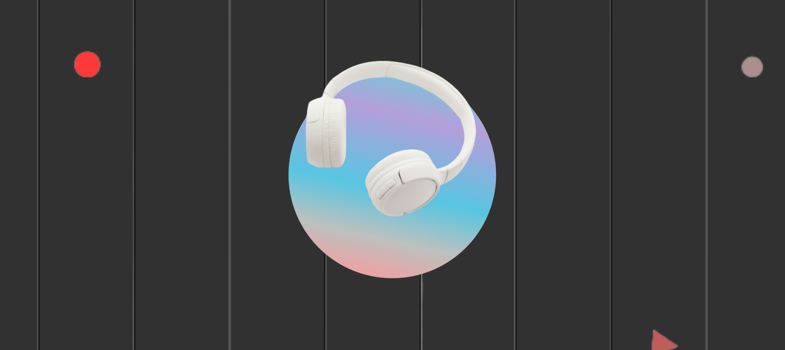

# 🎧 Animated Headphone Project
This is a visually engaging animated web page featuring a black-and-white grid background, a gradient circle, and floating headphones. The animation includes color transitions and floating effects, delivering a modern, tech-inspired visual experience.

## 📸 Demo


## 🚀 Features
- Floating headphones animation
- Gradient circle with smooth transitions
- Black-and-white grid background
- Background color toggle animation
- Fully responsive design

## 🛠️ Technologies Used
- HTML5
- CSS3
- JavaScript

## 📂 Folder Structure
```bash
animated-headphone-project/
├── index.html
├── style.css
├── script.js
├── headphones.png
├── screenshot.png
└── README.md
```
## 🔗 Live Demo
Check out the live project here: [Animated Headphone Project](https://luminous-stroopwafel-3aaa5f.netlify.app)


## 🧑‍💻 Author
**Ushasree Bayya**

## 📝 Acknowledgements
- Design inspired by modern UI animation trends  
- Floating effects based on basic keyframe animations  
- Created as part of my frontend development learning journey  
- Special thanks to open-source tutorials and design inspiration

